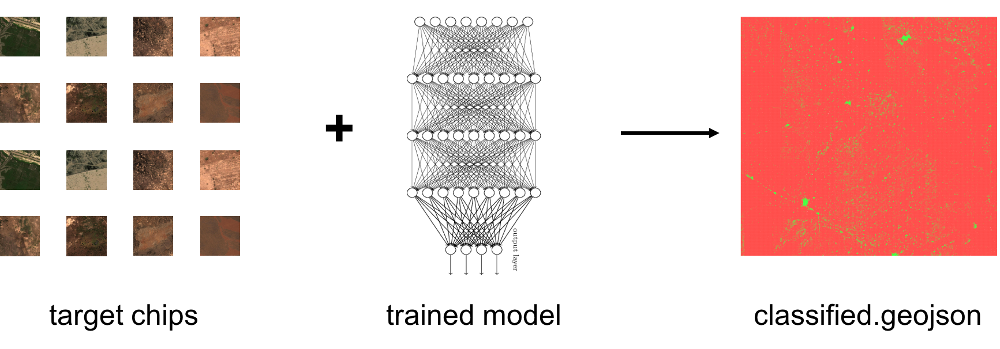
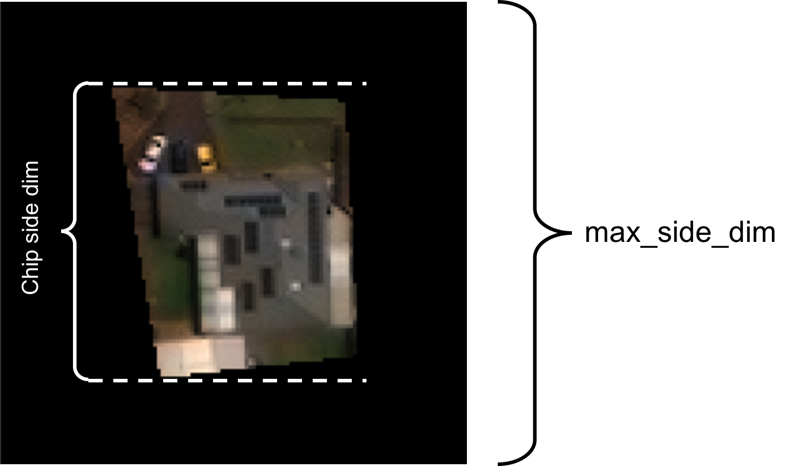

# Deploy CNN Chip Classifier

Deploys a trained Convolutional Neural Network (CNN) classifier on a set of target GeoTiff image chips. The task returns a geojson file 'classified.geojson' containing the input chip geometries and feature ids, each with a classification result and confidence score. The input model is a trained [Keras CNN](https://keras.io/) that should be obtained from [train-cnn-chip-classifier](https://github.com/PlatformStories/train-cnn-chip-classifier).




## Run

Here we run though a sample execution of the deploy-cnn-chip-classifier task. We will be deploying a model that classifies chips in Nigeria as 'No Buildings' or 'Buildings'. All of the input data is available in the S3 locations specified below.

1. Within an iPython terminal create a GBDX interface an specify the task input location:  

    ```python
    from gbdxtools import Interface
    from os.path import join
    import uuid

    gbdx = Interface()

    input_location = 's3://gbd-customer-data/58600248-2927-4523-b44b-5fec3d278c09/platform-stories/deploy-cnn-chip-classifier/'
    ```

2. Create a task instance and set the required [inputs](#inputs):  

    ```python
    deploy_task = gbdx.Task('deploy-cnn-chip-classifier')
    deploy_task.inputs.model = join(input_location, 'model')
    deploy_task.inputs.chips = join(input_location, 'chips')
    ```

3. Specify the classes for the deploy task. We can also restrict the size of chips that we deploy on and set the appropriate bit depth for the input imagery:  

    ```python
    deploy_task.inputs.classes = 'No Buildings, Buildings'
    deploy_task.inputs.bit_depth = '8'
    deploy_task.inputs.max_side_dim = '270'
    ```

4. Initialize a workflow and specify where to save the output:  

    ```python
    deploy_wf = gbdx.Workflow([deploy_task])
    random_str = str(uuid.uuid4())
    output_location = join('platform-stories/trial-runs', random_str)

    deploy_wf.savedata(deploy_task.outputs.classified_geojson, join(output_location, 'classified_geojson'))
    ```

5. Execute the workflow:  

    ```python
    deploy_wf.execute()
    ```

6. Track the status of the workflow as follows:

    ```python
    deploy_wf.status
    ```


### Input Ports

The following table lists the input ports of deploy-cnn-chip-classifier. Note that booleans, integers and floats **must be** passed to the task as strings, e.g., 'True', '10', '0.001'.

| Name | Valid Values | Description | Required |
|------|--------------|-------------|----------|
| chips | Directory | Contains GeoTiff image chips (feature_id.tif) and a reference geojson. Should be the output of chip-from-vrt. | True |
| model | Directory | Contains a trained Keras model that will be used to classify the chips. This should be the output of the train-cnn-chip-classifier task. | True |
| classes | String | The classes to sort each chip into. Different class names should be separated by commas and must be in the same order that the model was trained on (e.g- 'No Buildings, Buildings'). If this is omitted the classes will be obtained from the info/classes.json file in the model input. | False |
| bit_depth | String | Bit depth of the chips. This is necessary for proper normalization of the input to the network. Defaults to 8. | False |
| min_side_dim | String | Minimum acceptable side dimension (in pixels) of chips to classify. Defaults to 0. | False |
| max_side_dim | String | Maximum acceptable side dimension (in pixels) of chips to classify. If this is different than the input_shape side dimension of the input model, chips will be reshaped to match the input_shape. Defaults to the size specified by the model input. | False |


## Output Ports

deploy-cnn-chip-classifier has one output as detailed below.

| Name  | Type | Description:                                      |
|-------|------|---------------------------------------------------|
| classified_geojson | Directory | Contains the file classified.geojson. Each feature has a 'CNN_class' and certainty properties, which represent the model's classification and confidence in the classification, respectively. |


## Advanced

### Chip Size Restriction

A chip's side dimensions are determined by it's bounding box size. If the width or height of a chip exceeds the input max_side_dimension to the network it will be omitted from classified.geojson. Additionally, if the min_side_dim argument is used, any chip with a smaller side dimension will be omitted from the output file.



### Classes

The classes argument is simply a naming convention. If this is left blank class names will be loaded from the info/classes.json file that exists in the model input directory. It is essential that the class names be in the same order as the class list on which you trained your model.  


## Development

### Build the Docker Image

You need to install [Docker](https://docs.docker.com/engine/installation/)  

Clone the repository:

```bash
git clone https://github.com/platformstories/train-cnn-chip-classifier
```

Then:

```bash
cd deploy-cnn-chip-classifier
docker build -t yourusername/deploy-cnn-chip-classifier
```

Then push the image to Docker Hub:

```bash
docker push yourusername/deploy-cnn-chip-classifier
```

The image name should be the same as the image name under containerDescriptors in deploy-cnn-chip-classifier.json.


### Register on GBDX

In a Python terminal:

```python
from gbdxtools import Interface
gbdx = Interface()
gbdx.task_registry.register(json_filename='deploy-cnn-chip-classifier.json')
```
